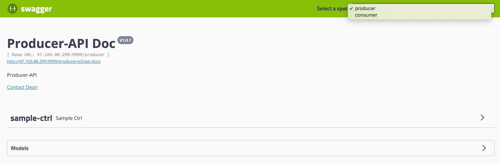
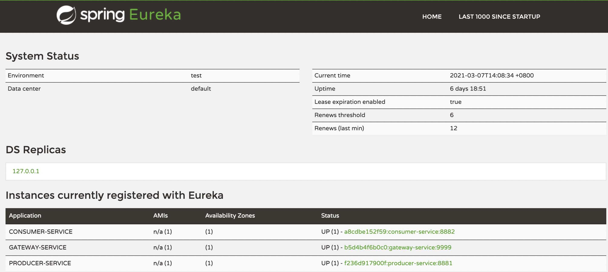
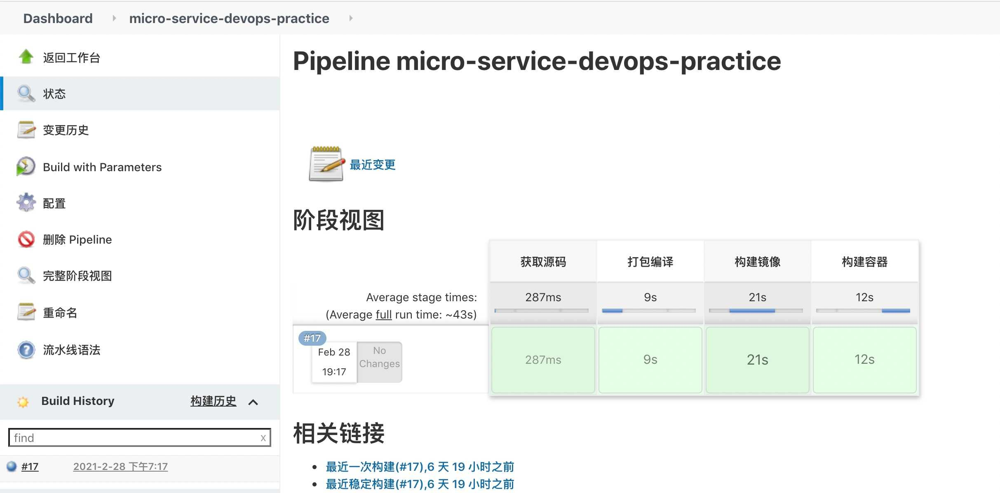
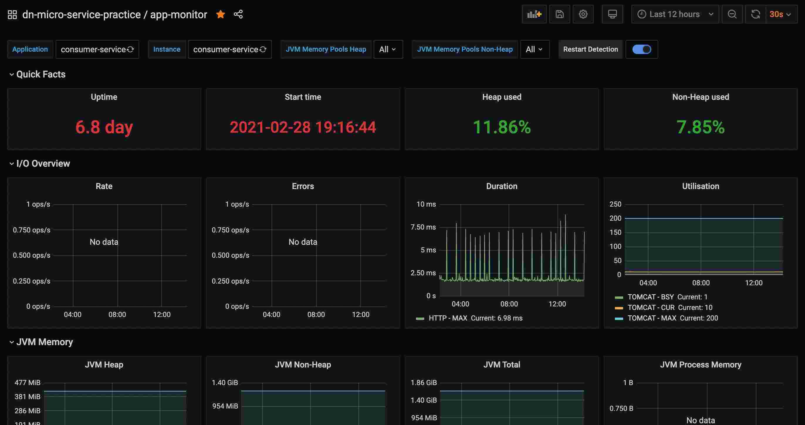
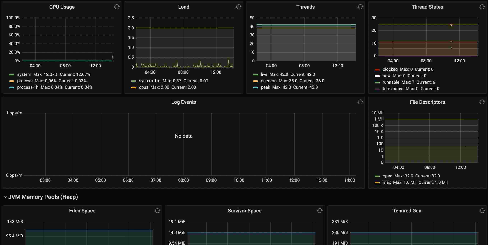
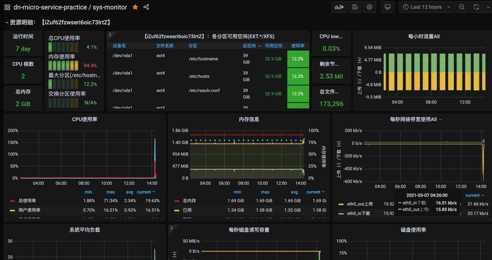
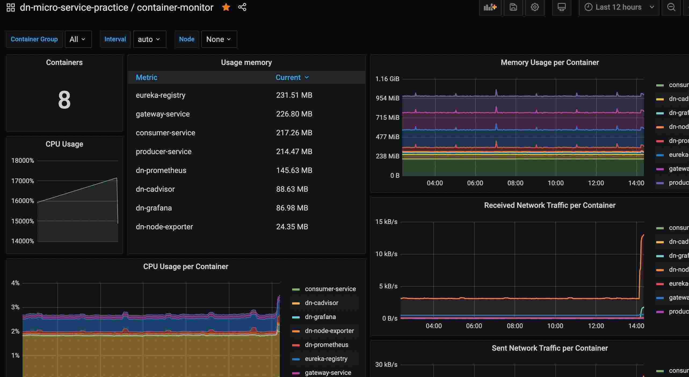
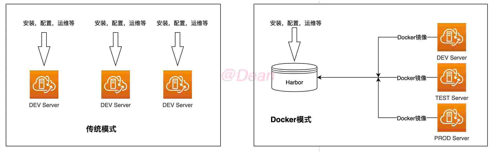

# devops

> 基于spring-cloud微服务架构，实践docker compose编排容器，docker容器CICD自动化部署,运维监控等

## 1 环境

| 工具  | 版本或描述 |
| ----- | ---|
| JDK   | 1.8  |
| IDE   |  `IntelliJ` IDEA |
| Maven | 3.x                  |
| spring-cloud-dependencies | Greenwich.SR2 |
| spring-boot-starter | 2.1.6.RELEASE |
| spring-cloud-starter-netflix-eureka-client | 2.1.2.RELEASE |
| spring-cloud-starter-netflix-eureka-server | 2.1.2.RELEASE |
| spring-cloud-starter-gateway | 2.1.2.RELEASE |

## 2 实践规划
服务 | 端口 |功能|状态|描述|
:---|:---:|:-----|:----|:---
`gateway-service` | `9999` | API网关| ✅| [网关API](http://47.103.88.209:9999/swagger-ui.html) 
`eureka-registry` | `8761`| 注册中心| ✅| [注册中心地址](http://47.103.88.209:8761/)
`producer-service` | `8881`| 服务提供者| ✅| 经网关调用：[http://47.103.88.209:9999/producer/hello](http://47.103.88.209:9999/producer/hello) 
`consumer-service` | `8882`| 服务消费者| ✅| 经网关调用：[http://47.103.88.209:9999/consumer/hello](http://47.103.88.209:9999/consumer/hello)  调用`producer-service`服务：[http://47.103.88.209:9999/consumer/call](http://47.103.88.209:9999/consumer/call)
`CI/CD` |`8888` |  | ✅ |  [Jenkins](http://115.159.192.74:8888/) 账户密码: user_sample/user_123
APP应用监控 | | | ✅ |[app-monitor](http://47.103.88.209:3000/d/8Z4_LPsMk/app-monitor?orgId=1&refresh=30s) 账户密码: user_sample/user_123
OS系统监控 | | | ✅ |[sys-monitor](http://47.103.88.209:3000/d/9CWBz0bik/sys-monitor?orgId=1) 账户密码: user_sample/user_123
Container容器监控 | ||✅|[container-monitor](http://47.103.88.209:3000/d/p6JPYPyMz/container-monitor?orgId=1&refresh=5m) 账户密码: user_sample/user_123

## 3 详情摘录图

>**网关路由在线doc**

 

>**eureka注册中心**

 

>**jenkins CI/CD部署**

 

>**app运行监控**

 

>**OS操作系统监控**

 

>**docker容器监控**

## 4 架构设计🖌（DOING）

> docker部署与传统部署的区别

